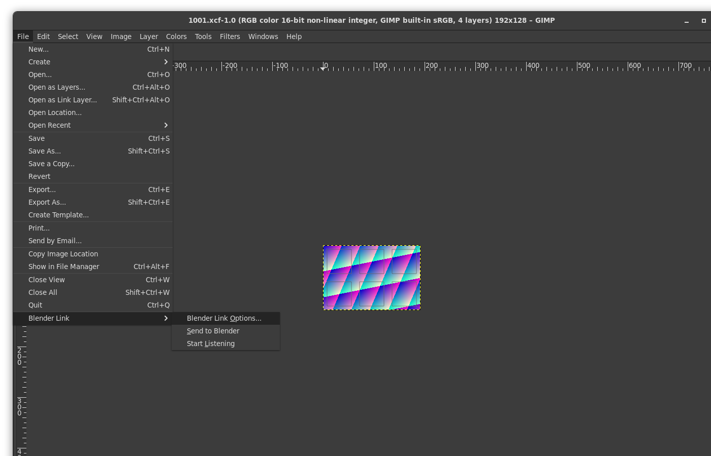
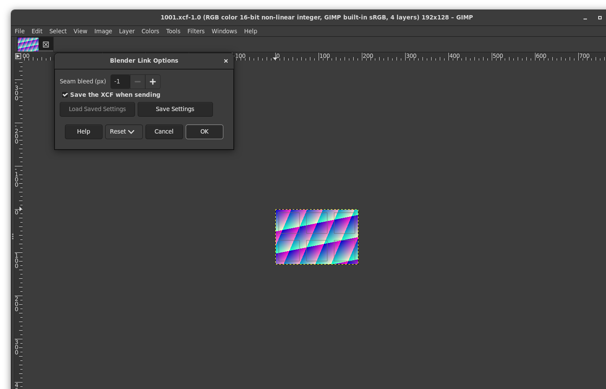

# GIMP Link for Blender

Edit a Blender texture in GIMP 3 and see it back on the model a moment
later. In Blender, **Edit in GIMP**; in GIMP, paint on a layered image
with the UV layout on top; **File > Blender Link > Send to Blender**,
and Blender reloads the texture.

"GIMP is a better editor and Krita is a better generator, so it makes
sense to have both tools available." GIMP Link sits next to
[Blender Krita Link](https://github.com/heisenshark/blender-krita-link-plugin)
and [Blender Layer](https://github.com/Yuntokon/BlenderLayer): it has
its own add-on, panel and port, and it works through the texture files
on disk, so the same texture can go to Krita, GIMP and Blender in turn
without any link holding it.

Two parts, both needed:

- a Blender add-on (Blender 4.2 and later as an extension, also as a
  legacy add-on), tested with Blender 5.2;
- a GIMP 3 plug-in in Python, tested with GIMP 3.2.6.

Both work as Flatpaks, the way they are installed on Linux from
Flathub, without any Flatpak overrides.

## What you get

- **Edit in GIMP** on the active image, from the Image Editor (sidebar
  tab "GIMP Link", or Image > Edit in GIMP) or the 3D Viewport in
  Texture Paint mode (sidebar tab "GIMP Link").
- In GIMP, a layered XCF next to your .blend:
  - **Texture**: the texture, with its exact pixel values;
  - **Paint**: an empty layer to paint on;
  - **UV Layout**: the UV faces as a link layer (GIMP 3.2), which
    follows the SVG when the UVs change;
  - **UV Islands**: the outlines of the islands only, as a second link
    layer, hidden;
  - paths **Island 0, Island 1, ...**, one per UV island (Path to
    Selection masks painting to one island), and a channel **UV
    Islands** with all of them.
- **Send to Blender** writes the texture (without the UV layers), can
  spread the islands' colours a few pixels outward (seam bleed), saves
  the XCF and tells Blender, which reloads the image at once.
- Next time, Edit in GIMP opens the same XCF with all your layers. If
  the texture changed outside GIMP in the meantime (painted in Blender,
  edited in Krita), it arrives as a new layer "Changed outside GIMP"
  on top, so nothing is lost.
- **Get from GIMP** in Blender asks GIMP to send, if you stay in Blender.
- **Update UVs** writes the UV layout again; GIMP's UV layer follows by
  itself and the island paths are replaced.
- If Blender has unsaved paint on the image when the file changes on
  disk, it does not throw the paint away: the panel says "Changed on
  disk" and offers Reload or Ignore. A Send from GIMP reloads anyway,
  after keeping Blender's pixels in `backups/`.

## Install

Build the files with `tools/build.sh` (they land in `dist/`), or take
them from a release.

### Blender

- **Extension** (Blender 4.2 and later): Edit > Preferences > Get
  Extensions, the menu at the top right, **Install from Disk...**, and
  choose `gimp_link-<version>.zip`.
- **Legacy add-on**: Edit > Preferences > Add-ons, the menu at the top
  right, **Install from Disk...**, choose
  `gimp_link-<version>-legacy-addon.zip`, and enable "GIMP Link". Or
  unpack it into your scripts folder's `addons/`.

The Flatpak Blender needs nothing more.

### GIMP

Unpack `gimp-blender-link-<version>-gimp.zip` into GIMP's plug-in folder,
so that you have `plug-ins/gimp-blender-link/gimp-blender-link.py`, and
restart GIMP:

- Linux, native or **Flatpak**: `~/.config/GIMP/3.2/plug-ins/` (the
  GIMP Flatpak uses this same folder: it has access to
  `~/.config/GIMP`). On Linux and macOS the `.py` file must be
  executable (`chmod +x`), which the zip keeps.
- Windows: `%APPDATA%\GIMP\3.2\plug-ins\`
- macOS: `~/Library/Application Support/GIMP/3.2/plug-ins/`

(Windows and macOS were not tried.) GIMP needs its Python support; the
Flatpak has it (checked); for other builds, Filters > Development >
Python-Fu shows whether yours does.

## Use

1. Start GIMP. The plug-in starts listening for Blender by itself (on
   127.0.0.1 only).
2. In Blender, show the image in the Image Editor (or pick the paint
   slot in Texture Paint) and click **Edit in GIMP**. If GIMP is not
   running yet, start it: the request waits and GIMP opens the texture
   when it starts.
3. Paint on the **Paint** layer, or add layers as you like. The UV
   layers are only a guide; they are left out of the texture.
4. **File > Blender Link > Send to Blender**. Blender shows the change
   about half a second later (at once if Blender got GIMP's message).

Shortcuts:

- GIMP: Edit > Keyboard Shortcuts, search "Send to Blender", assign
  for example Ctrl+Shift+B. Send has no dialog, so it is one key.
- Blender: right-click **Edit in GIMP** or **Get from GIMP**, Assign
  Shortcut.

Seam bleed: **File > Blender Link > Blender Link Options...** sets the
number of pixels for this image (and whether Send also saves the XCF);
the add-on's preferences set the default for new images ("Seam bleed",
0 by default, as it changes pixels outside the islands).

### Which file GIMP edits

- An image that is a file on disk (PNG, OpenEXR, TIFF, Targa, BMP,
  WebP) is edited **in place**: GIMP writes back into the same file,
  with the same format and bit depth. That is what lets Krita, GIMP and
  Blender share it. Unsaved Blender changes are saved first.
- Anything else (generated or packed images, JPEG) gets an **exchange
  copy**: colour images as 16-bit PNG, float and Non-Color images as
  32-bit float OpenEXR. The Blender image is then pointed at that file,
  with its colour space unchanged.

The XCF, the UV files and the manifest are in a folder
`<blend name>_gimplink/<image>-<id>/` next to the saved .blend; for an
unsaved .blend, under `~/.local/share/gimp-blender-link/exchange/`.
Never under `/tmp`: Blender's Flatpak has a `/tmp` of its own that GIMP
cannot see.

### Colour

| Image in Blender | GIMP works in | Written back as |
|---|---|---|
| sRGB colour, 8 or 16 bit | 16-bit perceptual | the file's depth (exchange copy: 16-bit PNG) |
| Non-Color (normal, roughness...) in a PNG | 16-bit **linear**, the numbers reinterpreted, not converted | the same numbers, the file's depth |
| float or Non-Color, exchange copy or EXR | 32-bit float linear (half for a half EXR) | OpenEXR, exact |

No colour profile conversions happen anywhere, and the view transform
is never baked into a file (the add-on uses `Image.save`, never
`save_render`). In a data map, paint blends linearly on the stored
numbers. The tests check the values: 8-bit and 16-bit PNG and float EXR
come back exact.

## With Blender Krita Link and Blender Layer

They can all be installed at once:

| | GIMP Link | Blender Krita Link | Blender Layer |
|---|---|---|---|
| Blender add-on | GIMP Link (`gimplink.*`, `Image.gimplink`) | Blender Krita link (`Scene.global_store`) | Connect to Krita (Blender Layer) |
| Sidebar tab | GIMP Link | Blender Krita Link | (Krita docker) |
| Port | GIMP listens on 29317, Blender on a free port | 65431 | 65432 |
| Pixels move through | files under `$HOME` | shared memory | shared memory or socket |

A way to use them together: generate or paint broadly in Krita (with
Blender Krita Link, or a file layer on the texture file), save the
image in Blender, **Edit in GIMP** for the careful work, Send to
Blender. Only let one program write a texture at a time: the last write
wins, and GIMP Link's conflict check only protects unsaved paint inside
Blender.

## Flatpak notes

- Nothing to set up: both Flatpaks share the network (127.0.0.1) and
  the home folder.
- GIMP cannot be started from inside Blender's Flatpak without a
  Flatpak override that lets Blender run any program on the host:

      flatpak override --user --talk-name=org.freedesktop.Flatpak org.blender.Blender

  and then, in the add-on's preferences, "Start GIMP with":
  `flatpak-spawn --host flatpak run org.gimp.GIMP`. This was not tested
  (the development rules here forbid changing overrides), and it is not
  needed: start GIMP yourself, and it picks up Blender's request. With
  a native Blender, `flatpak run org.gimp.GIMP` or `gimp` works as the
  command without any override.
- The link folder is `~/.local/share/gimp-blender-link/` as a literal
  path (each Flatpak has its own `XDG_DATA_HOME`, so that variable
  cannot be used). `GIMP_BLENDER_LINK_DIR` changes it for both apps.

## Settings

- Blender: Edit > Preferences > Add-ons > GIMP Link: exchange folder,
  how often to check for changes (0.5 s), seam bleed default, island
  masks, the command that starts GIMP.
- GIMP: `~/.local/share/gimp-blender-link/gimp-settings.json`, for
  example `{"autostart": false, "port": 29317}`. With autostart off,
  **File > Blender Link > Start Listening** starts the listener.
- Environment: `GIMP_BLENDER_LINK_DIR` (link folder),
  `GIMP_BLENDER_LINK_PORT` (GIMP's port), `GIMP_BLENDER_LINK_DEBUG=1`
  (the GIMP side prints what it does).

## How it works

Details in [docs/design.md](docs/design.md); what it learned from the
other links in [docs/prior-art.md](docs/prior-art.md).

- The add-on writes the texture, `uv-1001.svg`, `islands-1001.svg`,
  `island-ids-1001.png` (16-bit, island number + 1),
  `islands-mask-1001.png` and `manifest.json`, then sends GIMP one line
  of JSON over 127.0.0.1 (or leaves it in the link folder's `pending/`).
- The GIMP plug-in has a procedure without arguments of the PERSISTENT
  kind, which GIMP starts at startup; it serves a `Gio.SocketService`
  from its own main loop, answers at once and does the work on idle,
  so GIMP stays responsive. Each request carries a random token that
  the other side wrote into a file only you can read.
- Send writes the texture to a temporary file and renames it over the
  old one, then tells Blender. Blender also polls the file by path (a
  change counts once it is stable over two checks, or complete, or
  announced by GIMP) and ignores its own writes, all on Blender's main
  thread through `bpy.app.timers`.

## Limits

- No layered file goes to Blender (Blender cannot read XCF); GIMP sends
  a flattened texture.
- UDIM: every tile is its own XCF, and Edit in GIMP opens all of them.
  Generated or packed UDIM images are written by Blender as
  8-bit PNG or EXR tiles (not tested as thoroughly as single images).
- UV islands are taken from the original mesh (without modifiers), with
  the active UV map or the one an image texture node names. UVs
  outside 0 to 1 on a non-UDIM image fall outside the layout's canvas.
- Island masks are rasterised in Python with numpy, one triangle at a
  time; on very dense meshes they take a while (they can be turned
  off).
- Alpha: PNG keeps straight alpha. Partially transparent textures going
  through OpenEXR were not tested.
- A texture with an embedded non-sRGB ICC profile is converted to sRGB
  when GIMP loads it (GIMP Link adds no conversion of its own).
- GIMP can't show a second window for an image that is already open;
  Edit in GIMP then only brings in outside changes.
- If GIMP crashes, its listener file stays behind; Blender then finds
  nobody listening and leaves the request pending, which is correct.
- Only 127.0.0.1: no editing across machines.
- Not done: the "better Quick Edit" (paint the current 3D view in GIMP
  and project it back).
- Tested on Linux with the Blender 5.2 and GIMP 3.2.6 Flatpaks. Windows
  and macOS paths are handled but were never run.

## Tests

    tests/run.sh           everything (the GUI test only with Chrome and node 22)
    GBL_GUI=0 tests/run.sh without the GUI test

One command, no network, no display; PASS or FAIL per case, non-zero
exit on failure. It runs, with throwaway Blender and GIMP profiles, a
throwaway link folder and port under `tests/output/`:

- lint: no em or en dashes, identical shared modules, Python compiles,
  the extension manifest validates;
- the extension and the legacy zip, installed in a throwaway Blender;
- the protocol, the watcher and the PNG code in plain Python (tokens,
  bad messages, reconnects, half-written files);
- headless Blender: a cube with six UV islands and four known textures
  (8-bit sRGB, float Non-Color, an 8-bit file, an 8-bit normal map),
  UDIM tiles, the UV SVG, exact island masks, the manifest;
- headless GIMP (gimp-console): the XCF, its layers, precision and
  exact pixels, the UV link layer following its SVG, painting known
  rectangles, Send, seam bleed checked pixel by pixel, reopening, a
  change made outside GIMP, the plug-in's procedures;
- headless Blender again: GIMP's paint at its UV location (within
  1/65535 for 16-bit PNG, exact for EXR), colour spaces unchanged, the
  watcher, a conflict with unsaved paint, the reload message;
- end to end: the resident listener in gimp-console and a headless
  Blender over the socket, including a request left before GIMP starts;
- GUI: the listener in a real GIMP on a Broadway display, looked at with
  a headless Chrome (needs
  [gimp-plugin-devtools](https://github.com/sandbranch/gimp-plugin-devtools)
  next to this folder for `gui/cdp.mjs`): opening in a window, menus,
  Send to Blender from the File menu, the Options dialog.

## Credits

Written from scratch; no code was copied. Ideas taken, with thanks:

- [GoB](https://github.com/JoseConseco/GoB) (GPL-3.0-or-later): a timer
  polling a file's modification time, and ignoring your own writes.
- [Auto Reload](https://github.com/samytichadou/Auto_Reload_Blender_addon)
  (GPL-3.0-or-later): reloading textures from a timer, UDIM tiles; its
  issue #13 (GIMP exports reloaded half written) led to the settle check.
- [Blockbench](https://github.com/JannisX11/blockbench) (GPL-3.0-or-later):
  the edit-externally loop with a file watcher and echo suppression.
- [Blender Krita Link](https://github.com/heisenshark/blender-krita-link-plugin)
  (GPL-3.0), [Blender Layer](https://github.com/Yuntokon/BlenderLayer)
  and [its V2](https://github.com/JovasMotionDesigner/Blender-Leyer-V2)
  (GPL-3.0), [Spritedash](https://github.com/Half-Baked-Park/spritedash)
  (GPL-3.0-or-later, after [Pribambase](https://github.com/AlienPolygon/pribambase)):
  live links between Blender and a 2D editor, UV layouts sent across,
  and what their users ran into.
- [blender_psd](https://github.com/heinn-dev/blender_psd) (no licence
  file, so ideas only): not overwriting unsaved paint when the file
  changes.

## License

GPL-3.0-or-later. See [COPYING](COPYING).
